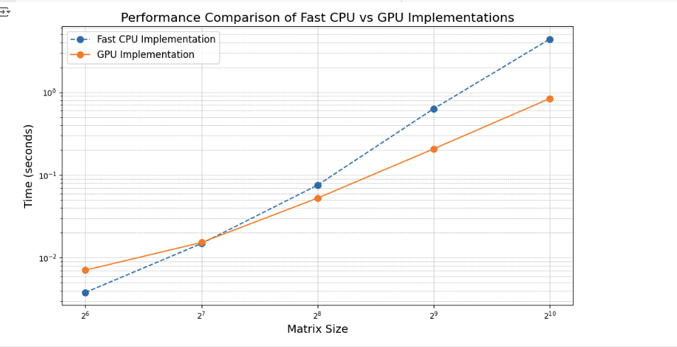
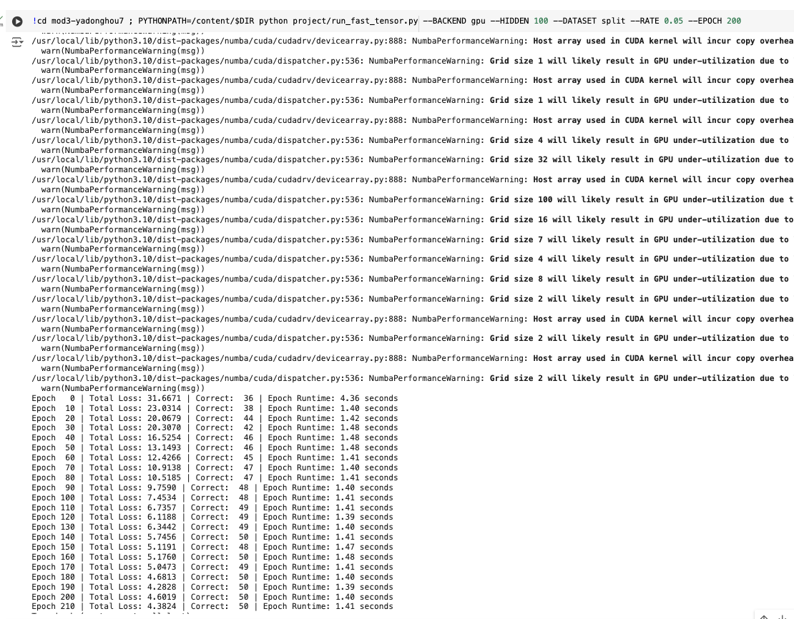

# MiniTorch Module 3


* Docs: https://minitorch.github.io/

* Overview: https://minitorch.github.io/module3.html


You will need to modify `tensor_functions.py` slightly in this assignment.

* Tests:

```
python run_tests.py
```

* Note:

Several of the tests for this assignment will only run if you are on a GPU machine and will not
run on github's test infrastructure. Please follow the instructions to setup up a colab machine
to run these tests.

This assignment requires the following files from the previous assignments. You can get these by running

```bash
python sync_previous_module.py previous-module-dir current-module-dir
```

The files that will be synced are:

        minitorch/tensor_data.py minitorch/tensor_functions.py minitorch/tensor_ops.py minitorch/operators.py minitorch/scalar.py minitorch/scalar_functions.py minitorch/module.py minitorch/autodiff.py minitorch/module.py project/run_manual.py project/run_scalar.py project/run_tensor.py minitorch/operators.py minitorch/module.py minitorch/autodiff.py minitorch/tensor.py minitorch/datasets.py minitorch/testing.py minitorch/optim.py


## Task 3.1 and 3.2
**Optimization Log:**
```
(base) yadonghou@Yadongs-MacBook-Pro mod3-yadonghou7 % python3 project/parallel_check.py
Traceback (most recent call last):
  File "/Users/yadonghou/Documents/workspace/mod3-yadonghou7/project/parallel_check.py", line 1, in <module>
    from numba import njit
ModuleNotFoundError: No module named 'numba'
(base) yadonghou@Yadongs-MacBook-Pro mod3-yadonghou7 % python3 project/parallel_check.py
Traceback (most recent call last):
  File "/Users/yadonghou/Documents/workspace/mod3-yadonghou7/project/parallel_check.py", line 1, in <module>
    from numba import njit
ModuleNotFoundError: No module named 'numba'
(base) yadonghou@Yadongs-MacBook-Pro mod3-yadonghou7 % source .venv/bin/activate
(.venv) (base) yadonghou@Yadongs-MacBook-Pro mod3-yadonghou7 % python3 project/parallel_check.py
MAP

================================================================================
 Parallel Accelerator Optimizing:  Function tensor_map.<locals>._map,
/Users/yadonghou/Documents/workspace/mod3-yadonghou7/minitorch/fast_ops.py (163)

================================================================================


Parallel loop listing for  Function tensor_map.<locals>._map, /Users/yadonghou/Documents/workspace/mod3-yadonghou7/minitorch/fast_ops.py (163)
-------------------------------------------------------------------------------------------|loop #ID
    def _map(                                                                              |
        out: Storage,                                                                      |
        out_shape: Shape,                                                                  |
        out_strides: Strides,                                                              |
        in_storage: Storage,                                                               |
        in_shape: Shape,                                                                   |
        in_strides: Strides,                                                               |
    ) -> None:                                                                             |
        if list(out_shape) == list(in_shape) and list(out_strides) == list(in_strides):    |
            for i in prange(len(out)):-----------------------------------------------------| #0
                out[i] = fn(in_storage[i])                                                 |
        else:                                                                              |
            for i in prange(len(out)):-----------------------------------------------------| #1
                in_i = np.empty(MAX_DIMS, np.int32)                                        |
                out_i = np.empty(MAX_DIMS, np.int32)                                       |
                temp_i = i                                                                 |
                to_index(temp_i, out_shape, out_i)                                         |
                broadcast_index(out_i, out_shape, in_shape, in_i)                          |
                in_pos = index_to_position(in_i, in_strides)                               |
                out_pos = index_to_position(out_i, out_strides)                            |
                out[out_pos] = fn(in_storage[in_pos])                                      |
--------------------------------- Fusing loops ---------------------------------
Attempting fusion of parallel loops (combines loops with similar properties)...
Following the attempted fusion of parallel for-loops there are 2 parallel for-
loop(s) (originating from loops labelled: #0, #1).
--------------------------------------------------------------------------------
----------------------------- Before Optimisation ------------------------------
--------------------------------------------------------------------------------
------------------------------ After Optimisation ------------------------------
Parallel structure is already optimal.
--------------------------------------------------------------------------------
--------------------------------------------------------------------------------

---------------------------Loop invariant code motion---------------------------
Allocation hoisting:
The memory allocation derived from the instruction at
/Users/yadonghou/Documents/workspace/mod3-yadonghou7/minitorch/fast_ops.py (176)
 is hoisted out of the parallel loop labelled #1 (it will be performed before
the loop is executed and reused inside the loop):
   Allocation:: in_i = np.empty(MAX_DIMS, np.int32)
    - numpy.empty() is used for the allocation.
The memory allocation derived from the instruction at
/Users/yadonghou/Documents/workspace/mod3-yadonghou7/minitorch/fast_ops.py (177)
 is hoisted out of the parallel loop labelled #1 (it will be performed before
the loop is executed and reused inside the loop):
   Allocation:: out_i = np.empty(MAX_DIMS, np.int32)
    - numpy.empty() is used for the allocation.
None
ZIP

================================================================================
 Parallel Accelerator Optimizing:  Function tensor_zip.<locals>._zip,
/Users/yadonghou/Documents/workspace/mod3-yadonghou7/minitorch/fast_ops.py (211)

================================================================================


Parallel loop listing for  Function tensor_zip.<locals>._zip, /Users/yadonghou/Documents/workspace/mod3-yadonghou7/minitorch/fast_ops.py (211)
------------------------------------------------------------------------------|loop #ID
    def _zip(                                                                 |
        out: Storage,                                                         |
        out_shape: Shape,                                                     |
        out_strides: Strides,                                                 |
        a_storage: Storage,                                                   |
        a_shape: Shape,                                                       |
        a_strides: Strides,                                                   |
        b_storage: Storage,                                                   |
        b_shape: Shape,                                                       |
        b_strides: Strides,                                                   |
    ) -> None:                                                                |
        """Element-wise binary operation on two tensors with broadcasting.    |
                                                                              |
        Args:                                                                 |
        ----                                                                  |
            out: Output storage for the result tensor.                        |
            out_shape: Shape of the output tensor.                            |
            out_strides: Strides of the output tensor.                        |
            a_storage: Storage for input tensor A.                            |
            a_shape: Shape of input tensor A.                                 |
            a_strides: Strides of input tensor A.                             |
            b_storage: Storage for input tensor B.                            |
            b_shape: Shape of input tensor B.                                 |
            b_strides: Strides of input tensor B.                             |
            fn: Binary function to apply to corresponding elements.           |
                                                                              |
        Returns:                                                              |
        -------                                                               |
            None. The result is written to `out`.                             |
                                                                              |
        """                                                                   |
        MAX_DIMS = len(out_shape)                                             |
                                                                              |
        # If shapes and strides are identical, avoid indexing                 |
        if (list(out_shape) == list(a_shape) == list(b_shape)) and (          |
            list(out_strides) == list(a_strides) == list(b_strides)           |
        ):                                                                    |
            for i in prange(len(out)):  # Parallel main loop------------------| #2
                out[i] = fn(a_storage[i], b_storage[i])                       |
        else:                                                                 |
            for i in prange(len(out)):  # Parallel loop with broadcasting-----| #3
                a_i = np.empty(MAX_DIMS, np.int32)                            |
                b_i = np.empty(MAX_DIMS, np.int32)                            |
                out_i = np.empty(MAX_DIMS, np.int32)                          |
                temp_i = i                                                    |
                to_index(temp_i, out_shape, out_i)                            |
                broadcast_index(out_i, out_shape, a_shape, a_i)               |
                broadcast_index(out_i, out_shape, b_shape, b_i)               |
                a_pos = index_to_position(a_i, a_strides)                     |
                b_pos = index_to_position(b_i, b_strides)                     |
                out_pos = index_to_position(out_i, out_strides)               |
                out[out_pos] = fn(a_storage[a_pos], b_storage[b_pos])         |
--------------------------------- Fusing loops ---------------------------------
Attempting fusion of parallel loops (combines loops with similar properties)...
Following the attempted fusion of parallel for-loops there are 2 parallel for-
loop(s) (originating from loops labelled: #2, #3).
--------------------------------------------------------------------------------
----------------------------- Before Optimisation ------------------------------
--------------------------------------------------------------------------------
------------------------------ After Optimisation ------------------------------
Parallel structure is already optimal.
--------------------------------------------------------------------------------
--------------------------------------------------------------------------------

---------------------------Loop invariant code motion---------------------------
Allocation hoisting:
The memory allocation derived from the instruction at
/Users/yadonghou/Documents/workspace/mod3-yadonghou7/minitorch/fast_ops.py (252)
 is hoisted out of the parallel loop labelled #3 (it will be performed before
the loop is executed and reused inside the loop):
   Allocation:: a_i = np.empty(MAX_DIMS, np.int32)
    - numpy.empty() is used for the allocation.
The memory allocation derived from the instruction at
/Users/yadonghou/Documents/workspace/mod3-yadonghou7/minitorch/fast_ops.py (253)
 is hoisted out of the parallel loop labelled #3 (it will be performed before
the loop is executed and reused inside the loop):
   Allocation:: b_i = np.empty(MAX_DIMS, np.int32)
    - numpy.empty() is used for the allocation.
The memory allocation derived from the instruction at
/Users/yadonghou/Documents/workspace/mod3-yadonghou7/minitorch/fast_ops.py (254)
 is hoisted out of the parallel loop labelled #3 (it will be performed before
the loop is executed and reused inside the loop):
   Allocation:: out_i = np.empty(MAX_DIMS, np.int32)
    - numpy.empty() is used for the allocation.
None
REDUCE

================================================================================
 Parallel Accelerator Optimizing:  Function tensor_reduce.<locals>._reduce,
/Users/yadonghou/Documents/workspace/mod3-yadonghou7/minitorch/fast_ops.py (288)

================================================================================


Parallel loop listing for  Function tensor_reduce.<locals>._reduce, /Users/yadonghou/Documents/workspace/mod3-yadonghou7/minitorch/fast_ops.py (288)
-----------------------------------------------------------------------------------------------|loop #ID
    def _reduce(                                                                               |
        out: Storage,                                                                          |
        out_shape: Shape,                                                                      |
        out_strides: Strides,                                                                  |
        a_storage: Storage,                                                                    |
        a_shape: Shape,                                                                        |
        a_strides: Strides,                                                                    |
        reduce_dim: int,                                                                       |
    ) -> None:                                                                                 |
        """Reduce a tensor along a specified dimension using a reduction function.             |
                                                                                               |
        Args:                                                                                  |
        ----                                                                                   |
            out: Output storage for the reduced tensor.                                        |
            out_shape: Shape of the output tensor.                                             |
            out_strides: Strides of the output tensor.                                         |
            a_storage: Storage for the input tensor.                                           |
            a_shape: Shape of the input tensor.                                                |
            a_strides: Strides of the input tensor.                                            |
            reduce_dim: The dimension along which to reduce.                                   |
            fn: Reduction function to apply.                                                   |
                                                                                               |
        Returns:                                                                               |
        -------                                                                                |
            None. The result is written to `out`.                                              |
                                                                                               |
        """                                                                                    |
        MAX_DIMS = len(a_shape)                                                                |
        reduce_size = a_shape[                                                                 |
            reduce_dim                                                                         |
        ]  # Number of elements in the reduction dimension                                     |
        reduce_stride = a_strides[reduce_dim]  # Stride for the reduction dimension            |
                                                                                               |
        for i in prange(len(out)):  # Parallel loop over output elements-----------------------| #4
            # Convert linear index `i` to multi-dimensional index for output tensor            |
            out_i = np.empty(MAX_DIMS, np.int32)                                               |
            temp_i = i                                                                         |
            to_index(temp_i, out_shape, out_i)                                                 |
                                                                                               |
            # Calculate linear positions in output and input storage                           |
            out_pos = index_to_position(out_i, out_strides)                                    |
            in_pos = index_to_position(out_i, a_strides)                                       |
                                                                                               |
            # Initialize the reduction with a neutral value (e.g., 0 for sum, -inf for max)    |
            cur = out[out_pos]                                                                 |
                                                                                               |
            # Perform the reduction along the specified dimension                              |
            for _ in range(reduce_size):                                                       |
                cur = fn(cur, a_storage[in_pos])                                               |
                in_pos += (                                                                    |
                    reduce_stride  # Move to the next element in the reduction dimension       |
                )                                                                              |
                                                                                               |
            # Write the reduced value to the output storage                                    |
            out[out_pos] = cur                                                                 |
--------------------------------- Fusing loops ---------------------------------
Attempting fusion of parallel loops (combines loops with similar properties)...
Following the attempted fusion of parallel for-loops there are 1 parallel for-
loop(s) (originating from loops labelled: #4).
--------------------------------------------------------------------------------
----------------------------- Before Optimisation ------------------------------
--------------------------------------------------------------------------------
------------------------------ After Optimisation ------------------------------
Parallel structure is already optimal.
--------------------------------------------------------------------------------
--------------------------------------------------------------------------------

---------------------------Loop invariant code motion---------------------------
Allocation hoisting:
The memory allocation derived from the instruction at
/Users/yadonghou/Documents/workspace/mod3-yadonghou7/minitorch/fast_ops.py (323)
 is hoisted out of the parallel loop labelled #4 (it will be performed before
the loop is executed and reused inside the loop):
   Allocation:: out_i = np.empty(MAX_DIMS, np.int32)
    - numpy.empty() is used for the allocation.
None
MATRIX MULTIPLY

================================================================================
 Parallel Accelerator Optimizing:  Function _tensor_matrix_multiply,
/Users/yadonghou/Documents/workspace/mod3-yadonghou7/minitorch/fast_ops.py (347)

================================================================================


Parallel loop listing for  Function _tensor_matrix_multiply, /Users/yadonghou/Documents/workspace/mod3-yadonghou7/minitorch/fast_ops.py (347)
----------------------------------------------------------------------------------------|loop #ID
def _tensor_matrix_multiply(                                                            |
    out: Storage,                                                                       |
    out_shape: Shape,                                                                   |
    out_strides: Strides,                                                               |
    a_storage: Storage,                                                                 |
    a_shape: Shape,                                                                     |
    a_strides: Strides,                                                                 |
    b_storage: Storage,                                                                 |
    b_shape: Shape,                                                                     |
    b_strides: Strides,                                                                 |
) -> None:                                                                              |
    """NUMBA tensor matrix multiply function.                                           |
                                                                                        |
    Should work for any tensor shapes that broadcast as long as                         |
                                                                                        |
    ```                                                                                 |
    assert a_shape[-1] == b_shape[-2]                                                   |
    ```                                                                                 |
                                                                                        |
    Optimizations:                                                                      |
                                                                                        |
    * Outer loop in parallel                                                            |
    * No index buffers or function calls                                                |
    * Inner loop should have no global writes, 1 multiply.                              |
                                                                                        |
                                                                                        |
    Args:                                                                               |
    ----                                                                                |
        out (Storage): storage for `out` tensor                                         |
        out_shape (Shape): shape for `out` tensor                                       |
        out_strides (Strides): strides for `out` tensor                                 |
        a_storage (Storage): storage for `a` tensor                                     |
        a_shape (Shape): shape for `a` tensor                                           |
        a_strides (Strides): strides for `a` tensor                                     |
        b_storage (Storage): storage for `b` tensor                                     |
        b_shape (Shape): shape for `b` tensor                                           |
        b_strides (Strides): strides for `b` tensor                                     |
                                                                                        |
    Returns:                                                                            |
    -------                                                                             |
        None : Fills in `out`                                                           |
                                                                                        |
    """                                                                                 |
    a_batch_stride = a_strides[0] if a_shape[0] > 1 else 0                              |
    b_batch_stride = b_strides[0] if b_shape[0] > 1 else 0                              |
                                                                                        |
    # TODO: Implement for Task 3.2.                                                     |
    reduce_size = a_shape[-1]  # Shared dimension                                       |
    a_inner_stride = a_strides[-1]  # Stride for inner dimension of A                   |
    b_inner_stride = b_strides[-2]  # Stride for inner dimension of B                   |
                                                                                        |
    # Outer loops (parallelized over batches and output elements)                       |
    for batch in prange(out_shape[0]):  # Iterate over batches--------------------------| #5
        for i in range(out_shape[1]):  # Iterate over rows of the result                |
            for j in range(out_shape[2]):  # Iterate over columns of the result         |
                # Initialize accumulation for the dot product                           |
                cur = 0.0                                                               |
                                                                                        |
                # Calculate starting positions for A and B                              |
                a_pos = batch * a_batch_stride + i * a_strides[-2]                      |
                b_pos = batch * b_batch_stride + j * b_strides[-1]                      |
                                                                                        |
                # Inner loop: Perform dot product                                       |
                for k in range(reduce_size):                                            |
                    cur += a_storage[a_pos] * b_storage[b_pos]                          |
                    a_pos += a_inner_stride  # Move along the row of A                  |
                    b_pos += b_inner_stride  # Move along the column of B               |
                                                                                        |
                # Write the result to the output tensor                                 |
                out_pos = (                                                             |
                    batch * out_strides[0] + i * out_strides[1] + j * out_strides[2]    |
                )                                                                       |
                out[out_pos] = cur                                                      |
--------------------------------- Fusing loops ---------------------------------
Attempting fusion of parallel loops (combines loops with similar properties)...
Following the attempted fusion of parallel for-loops there are 1 parallel for-
loop(s) (originating from loops labelled: #5).
--------------------------------------------------------------------------------
----------------------------- Before Optimisation ------------------------------
--------------------------------------------------------------------------------
------------------------------ After Optimisation ------------------------------
Parallel structure is already optimal.
--------------------------------------------------------------------------------
--------------------------------------------------------------------------------

---------------------------Loop invariant code motion---------------------------
Allocation hoisting:
No allocation hoisting found
None

```

## Test Result for Task3_3 and Task3_4


## Timing Graph



## Simple



## Simple-bigger


## Split


## XOR

